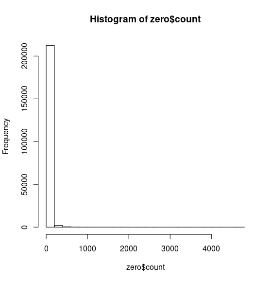
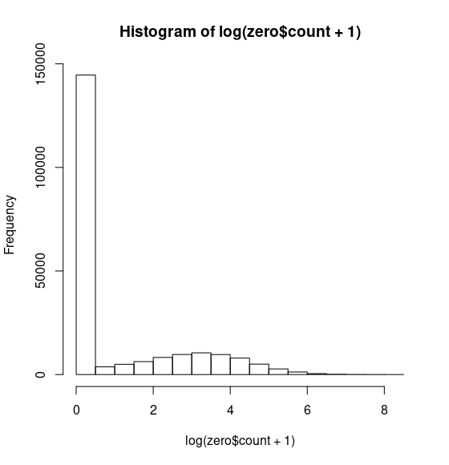
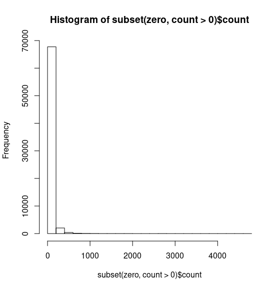
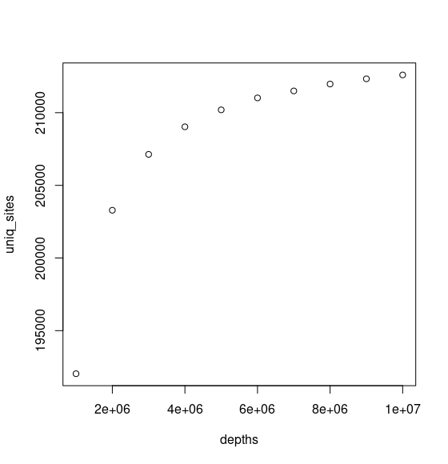
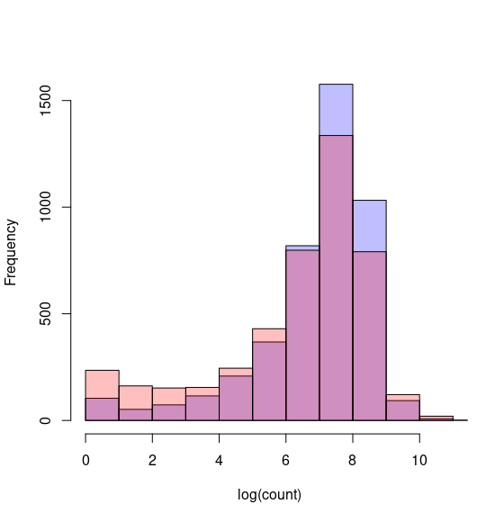

# Analysis of counts

Whether your experiment was a Himari-based or not, the analysis will use similar code. This is because there is little difference in the math between genes, TA sites, or any other feature. They are all just features in the matrix.

## Loading your data

```R
# Read in the count files (as BED) to a dataframe in R
zero <- read.delim("0h.trimmed.trimmed_TA_counts.bed", header=F, sep="\t")
five <- read.delim("5h.trimmed.trimmed_TA_counts.bed", header=F, sep="\t")
twentyfour <- read.delim(
    "24h.trimmed.trimmed_TA_counts.bed", header=F, sep="\t"
)

# Label the column names
colnames(zero) # show our current column names
#[1] "V1" "V2" "V3" "V4"

# Make a new column name and assign as a variable
col <- c("contig", "start", "end", "count")
# Assign new column names to each dataframe
colnames(zero) <- col
colnames(five) <- col
colnames(twentyfour) <- col

head(zero)
#       contig start end count
# 1 NC_000964.3    89  91     1
# 2 NC_000964.3    92  94     1
# 3 NC_000964.3   105 107     0
# 4 NC_000964.3   125 127     0
```

## Visualize the distribution of counts

First pass is to look at the histogram of the count distribution.

```R
hist(zero$count)
```



Because of zero-inflation, you may not be able to see much at all. So we will compress the dynamic range. As counts get larger, they'll be slotted into larger bins for the histogram. We do this with a simple log transformation.

```R
# Let's transform to log, to compress some of the dynamic range
# Add one to all counts to avoid log(0).
hist(
    log( zero$count + 1 )
)
```




Next, we can try to drop all the zeros to see what the distribution looks without the zero inflation. We still see a significant number of single count sites. This distribution is a very clear Poisson (zero-inflated).

```R
hist(
    subset(
        zero, count > 0
    )$count
)
```




## Visualizing the saturation curve

```R
uniq_name <- seq(1, length(zero$start))
prob <- zero$start / sum(zero$start)
# Create our subsample depths
# start depth, end depth, stepper
depths <- seq(1000000, 10000000, 1000000)

# We create a little function
bootstrapfunc <- function(x, y, p){
    # Start from inside out
    # 1. Sample with replacement the unique sites (given as y) this much 
    #    (given by x) and probability (given as p) with replacement
    # 2. Compress the list to only the unique sites
    # 3. Get the number of the uniq sites
    # 4. Return this number
    return(length(unique(sample(y, x, replace = T, prob = p))))
}
uniq_sites <- sapply(X = depths, FUN=bootstrapfunc, y = uniq_name, p = prob)
plot(depths, uniq_sites)
```



## Visualizing change in conditionally necessary genes

We will load the gene counts file that we produced.

```R
# Load the gene count data
geneCounts <- read.delim(
    "gene_counts.no_header.txt",
    header = T,
    sep = "\t"
)
# Plot the histograms
hist(
    log(geneCounts$X0h.trimmed.bam +1), 
    col=rgb(0,0,1,1/4), 
    xlab = "log(count)",
    main = ""
) # blue
hist(log(geneCounts$X5h.trimmed.bam + 1), col=rgb(1,0,0,1/4), add=T) # red
```



## Analysis of TA sites

### Normalization

You should investigate your data from the histograms to determine the appropriate normalization method. This library does not seem to have any particularly strong skewing or abnormal events.

However, we do see a strong shift the distribution of gene counts. So we will use a library size normalization, but only pull from the middle 80% of genes.

```R
# First, let's look at the distribution by quantile
# Get all non-zero TA targets, and break down by quantile.
quantile(subset(zero, count > 0)$count, seq(0, 1, 0.1))

>  0%  10%  20%  30%  40%  50%  60%  70%  80%  90% 100% 
>   1    3    6   10   15   22   31   44   65  111 4656 

# Let's choose 10-90% range (so 80% of all targets)
q <- quantile(subset(zero, count > 0)$count, seq(0, 1, 0.1))
zero.norm_factor <- sum(subset(zero, count >= q[1] & count <= q[10])$count)
# For just Total sum scaling, simply:
# zero.normfactor <- sum(zero$count)
q <- quantile(subset(five, count > 0)$count, seq(0, 1, 0.1))
five.norm_factor <- sum(subset(five, count >= q[1] & count <= q[10])$count)

# Apply these normalization factors
zero$count <- zero$count * 1000000 / zero.norm_factor
five$count <- five$count * 1000000 / five.norm_factor
```


### Set up the datasets for analysis

The original paper created a sliding window of 13 consecutive TA sites, and use that subset of the counts for a Mann Whitney U test. We need to, for each TA site, subset the counts of the 13 consecutive TA sites.

```R
# First we define a bunch of functions that produce one part of our results
# 1. Create a unique name for each window
# 2. Calculate the logFC for each window
# 3. Calculate the Wilcoxon Rank Sum test
getNameFunc <- function(x, df) {
    # Gets unique names for every 
    return(
        paste(
            paste(df$contig[x], df$start[x], sep=":"),
            df$end[x],
            sep="-"
        )
    )
}
getLogfcFunc <- function(x, countsA, countsB, flank) {
    # Gets logFC for every window
    # Sum each window's counts
    # Divide sum of B by sum of A
    # log transform
    return( 
        log(
            sum(countsA[(x-flank):(x+flank)])/sum(countsB[(x-flank):(x+flank)]),
            base=2
        ) 
    )
}
getPvalFunc <- function(x, countsA, countsB, flank) {
    # Gets wilcox test p-value results
    # First, sends a subset of count windows of A and B
    # Then, performs a Wilcoxon test
    # Finally, extracts just the p-value from the test
    return(
        wilcox.test(
            countsA[(x-flank):(x+flank)],
            countsB[(x-flank):(x+flank)],
            exact = F
        )$p.value
    )
}

# Now we define a few variables
flank <- 6 # The +/- size of the window
# A list of the index of the central loci of each window
# 1. The start index. This must be minimum the median length of your window
# 2. The end index. This must be maximum the size of all your TA sites minus
#    the median length of your window.
# 3. by = the step size of your sliding windows, increase for less overlap
#    Increasing larger than the flank size will mean no overlap and
#    missed TA sites.
windows = seq(
    7, 
    (length(zero$contig) - 7), 
    by = 1
)

# Now we apply those functions to the list of windows
locus <- sapply(X = windows, FUN = getNameFunc, df = zero)
logFC <- sapply(
    X = windows, FUN = getLogfcFunc, 
    countsA = zero$count, countsB = five$count, flank = flank
)
# We want to save time on the pvalue calculation (and prevent)
# odd errors and warnings.
# We will filter out all the Inf, -Inf, and NaN results found in
# logFC with is.finite()
# is.finite(logFC) will product a vector of size logFC with
# True or False. The values we want are True, and we subset 
# the windows with that.
is.finite(logFC)
pval <- sapply(
    X = windows[is.finite(logFC)], FUN = getPvalFunc,
    countsA = zero$count, countsB = five$count, flank = flank
)

# Merge all these into a dataframe
res <- data.frame(
    locus = locus[is.finite(logFC)],
    logFC = logFC[is.finite(logFC)],
    pvalue = pval
)
adj.pvalue <- p.adjust(res$pvalue, method = "fdr")
res$adj.pvalue <- adj.pvalue

head(res[order(res$adj.pvalue),], 20)

# Do we want to filter the results?
subset(res, pvalue < 0.02 & abs(logFC) > 3)
length(subset(res, pvalue < 0.02 & abs(logFC) > 3))
```

## Gene based analysis

Now, we are going to attempt a gene-based analysis process. Here, we will use the `featureCounts` output of total transposon reads aligning anywhere on the gene. This will aggregate insertion sites across the gene. The advantage are that we 1. gain stronger statistical power by aggregating the insertion sites and 2. is the most flexible analysis method with different TNSeq systems. It does have the the disadvantage of losing regional resolution. However, all this analysis can be performed on individual TA sites with Himar I systems.

### Loading the data

The gene counts are found in one file for all samples.

```R
# Load the data
featurecounts <- read.delim("gene_counts.no_header.txt", header=T, sep="\t")

# Create a simplified data frame with just the counts
# The RNASeq analysis libraries expect the data as just the counts
# Count the columns for 0h, 5h, and 24h
# They are the 7th, 8th, and 9th columns
# Subselect the columns with the [rows, columns]
counts <- featurecounts[, 7:9]
# Rename the columns
colnames(counts) <- c("zero", "five", "twentyfour")
# Rename the rownames
rownames(counts) <- featurecounts$Geneid

# Look at the new data frame
head(counts)
>               zero five twentyfour
>gene-BSU_00010   76    8          4
>gene-BSU_00020   31   11         29
>gene-BSU_00030   46    0          0
>gene-BSU_00040    1    3          3
>gene-BSU_00050  171    0          1
>gene-BSU_00060   46   10          3
```

Note: You would normally perform much of the same QC as before.

### QC

```R
# Histogram of all genes
hist(counts$zero)
# Histogram of log transformed genes
hist(log(counts$zero + 1))
# Histogram of non-zero log-transformed genes
hist(log(subset(counts, zero > 0)$zero))
# Visualize the saturation curve
prob <- counts$zero / sum(counts$zero)
depths <- seq(1000000, 10000000, 1000000)
bootstrapfunc <- function(x, y, p){
    return(length(unique(sample(y, x, replace = T, prob = p))))
}
uniq_sites <- sapply(
    X = depths, FUN = bootstrapfunc, 
    y = rownames(counts), p = prob
)
plot(depths, uniq_sites)
# Visualize histogram changes
hist(
    log(counts$zero +1), 
    col=rgb(0,0,1,1/4), 
    xlab = "log(count)",
    main = ""
) # blue
hist(log(counts$five + 1), col=rgb(1,0,0,1/4), add=T) # red
```

### Differential analysis

Optional: We only have one library per condition, so we don't have replicates. In this situation, I will compensate for this by bootstrapping the samples.

```R
# Create an empty count dataframe
counts.boot <- data.frame(
    zero1 = rep(0, length(rownames(counts))),
    zero2 = rep(0, length(rownames(counts))),
    zero3 = rep(0, length(rownames(counts))),
    five1 = rep(0, length(rownames(counts))),
    five2 = rep(0, length(rownames(counts))),
    five3 = rep(0, length(rownames(counts))),
    twentyfour1 = rep(0, length(rownames(counts))),
    twentyfour2 = rep(0, length(rownames(counts))),
    twentyfour3 = rep(0, length(rownames(counts)))
)

# Bootstrap
for (i in sample(
    seq(1, length(counts$zero)), 8000000, prob=counts$zero/sum(counts$zero), replace = T
)) {
    counts.boot$zero1[i] <- counts.boot$zero1[i] + 1
}
for (i in sample(
    seq(1, length(counts$zero)), 8000000, prob=counts$zero/sum(counts$zero), replace = T
)) {
    counts.boot$zero2[i] <- counts.boot$zero2[i] + 1
}
for (i in sample(
    seq(1, length(counts$zero)), 8000000, prob=counts$zero/sum(counts$zero), replace = T
)) {
    counts.boot$zero3[i] <- counts.boot$zero3[i] + 1
}
for (i in sample(
    seq(1, length(counts$zero)), 8000000, prob=counts$five/sum(counts$five), replace = T
)) {
    counts.boot$five1[i] <- counts.boot$five1[i] + 1
}
for (i in sample(
    seq(1, length(counts$zero)), 8000000, prob=counts$five/sum(counts$five), replace = T
)) {
    counts.boot$five2[i] <- counts.boot$five2[i] + 1
}
for (i in sample(
    seq(1, length(counts$zero)), 8000000, prob=counts$five/sum(counts$five), replace = T
)) {
    counts.boot$five3[i] <- counts.boot$five3[i] + 1
}
for (i in sample(
    seq(1, length(counts$zero)), 8000000, prob=counts$twentyfour/sum(counts$twentyfour), replace = T
)) {
    counts.boot$twentyfour1[i] <- counts.boot$twentyfour1[i] + 1
}
for (i in sample(
    seq(1, length(counts$zero)), 8000000, prob=counts$twentyfour/sum(counts$twentyfour), replace = T
)) {
    counts.boot$twentyfour2[i] <- counts.boot$twentyfour2[i] + 1
}
for (i in sample(
    seq(1, length(counts$zero)), 8000000, prob=counts$twentyfour/sum(counts$twentyfour), replace = T
)) {
    counts.boot$twentyfour3[i] <- counts.boot$twentyfour3[i] + 1
}

# Add the gene names
rownames(counts.boot) <- rownames(counts)

```

Now we will continue on with the analysis.

```R
library(DESeq2)

# Create a data frame that describes the various conditions of the samples
# Individual samples (columns of the counts) are the rows
# Can keep adding columns for as much annotation as the experiment requires
coldata <- data.frame(
    condition = as.factor(c(rep(0,3), rep(5, 3), rep(24,3))), 
    row.names = c(
        "zero1", "zero2", "zero3",
        "five", "five2", "five3",
        "twentyfour1", "twentyfour2", "twentyfour3"
    )
)

# 
dds <- DESeqDataSetFromMatrix(
    countData = counts.boot,
    colData = coldata,
    design = ~ condition
)
dds$condition <- relevel(dds$condition, ref = "0")

# Calculate the normalization factors, and apply the dds
normFunc <- function(x) {
    q <- quantile(x[x > 0], seq(0,1,0.1))
    return(
        sum(x[x >= q[1] & x <= q[10]])
    )
}
normFactors <- sapply(counts.boot, normFunc)
sizeFactors(dds) <- normFactors
dds <- estimateDispersions(dds)
dds <- nbinomWaldTest(dds)

# Get results
results(dds, contrast = c("condition", "0", "5"))
```